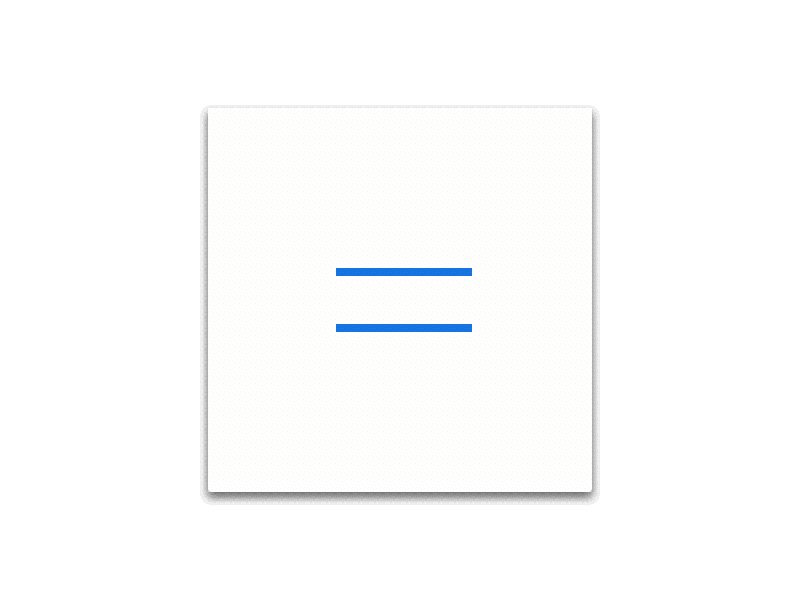
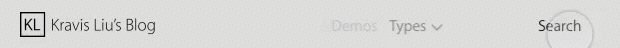

# blog_design Version 1.0
[详细文档](https://shimo.im/doc/quKkJaZK5DsqpbJk)

#### 2016.4.3

设计临时的 logo。

long style: 

short style: 

#### 2016.4.4

设计 `header`。

#### 2016.4.19

设计 `menu-icon` 的动画，参（剽）考（窃）于 [Apple](http://www.apple.com)。

#### 2016.5.3

设计 `search-form` 的动画。

#### 2016.5.4

初步完成 `global-header` 的代码部分。

##### Task List
- [x] 纠正 `sub-links` 在 Mobile 端的显示；
- [x] 完善 `.global-header-link.has-sub` 的 `menu-down` 动画；
- [x] 优化 iOS Safari 的 `input` 的外观；
- [x] 加入 `gh-links` 在 Mobile 端的动画；
- [x] 页面宽度变化后，媒体查询内的属性更改导致不期望的 `transition` 出现； // 通过添加 `global-header--closed` 类暂时解决，后续需要深入理解。
- [x] 为 Chrome 适配 `transition` 的 `0s` 和 `0`；
- [x] 消除不必要的背景高亮 `-webkit-tap-highlight-color`；
- [x] 把 `transform: none;` 加入试试效果； // 不合适，可能会降低性能
- [x] 暂时加入了 `will-change`； // 后续进行优化，适当的移除此属性，释放内存
- [x] 重命名大部分类名，例如 `global-header-links-link` 换为 `gh-menu-list-item`；
- [x] 移除 iOS Safari 的 outline；
- [x] 加入 JavaScript 用以自动计算 `transform: translateX(<value>)` 的值；
- [ ] 参考 Github，优化 `:hover` 伪类；
- [ ] 修正 `search-form` 的 `transition`；
- [ ] 进一步完善 `.gh-menu-list.has-sub` 的动画；
- [ ] Android Chrome 的 `onblur` 事件异常；
- [ ] 进行代码清理，使 CSS 和 JavaScript 更加规范化。
